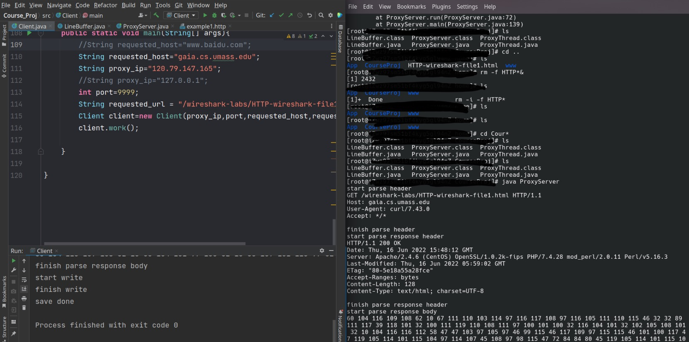

## Web Cache(Proxy) 项目说明

本项目基于Java socket编程实现，成功部署在阿里云服务器上工作。

## 类说明

`Client.java` 客户端

`PorxyServer.java` 服务器端

`LineBuffer.java` 输入流读取类

`ProxyServer.java` 套接字流转发线程

## 部署

- 客户端
  - `Client.java` 
  - `LineBuffer.java`
- 服务器端
  - `ProxyServer.java`
  - `ProxyBuffer.java`
  - `LineBuffer.java`

## 工作模式

​	客户端创建套接字连接服务器的`9999`端口，服务器监听`9999`端口并连接访问主机的`80`端口，转发请求头或直接返回客户端请求资源

## 运行方式

### Part 1 源代码修改

- `requested_host` 被访问的主机
- `proxy_ip` 代理服务器IP
- `requested_url` 请求资源的路径，目前不支持目录形式，需要指定到文件

Client：需要`Client.java` `LineBuffer.java` 在同一目录下

```shell
$javac Client.java
$java Client
```

Server：需要`ProxyServer.java`  `LineBuffer.java` `ProxyThread.java`

```shell
$javac Server.java
$java Server
```

## 设计过程

### Part1 命令行Demo

在linux下使用`socat`工具可以实现一个简单的代理流程

Client:

```shell
$socat - tcp:127.0.0.1:9999
```

与本机的9999端口建立连接

Server:

```shell
$socat - tcp-listen:9999
```

监听本机的9999端口

```shell
$socat - tcp:host:80
```

连接主机的80端口

### Part2 代码实现

java socket编程实现client 和 proxyserver的tcp连接。

Server的功能：解析来自Client的输入流，判断本地是否有client请求的文件。如果有，直接向Client传输该文件，否则向主机请求该文件，存在代理服务器本地，并向client返回文件。

### Part3 运行截图



左边是客户端运行输出，右边是服务器运行输出。打印的数字是传输字节的整数表示

### Part4 实现功能

- [x] 在本地部署客户端，在阿里云服务器部署代理服务器
- [x] http request解析和转发
- [x] 服务器存储和转发文件
- [x] 客户端存储文件

### Part5 待优化/实现的功能

- TCP 粘包的问题不能很好解决，本项目仍然把TCP流的末尾magic number来作为结束标志

> 解决方案：通过在流的头部发送有效字节数信息来结束对流的读取

- 鲁棒性不好，如果访问其它web服务器可能会出问题

- 不支持并发
- 未实现对文件目录的解析

- 未实现Conditional GET功能

本项目将开源至github并持续完善
